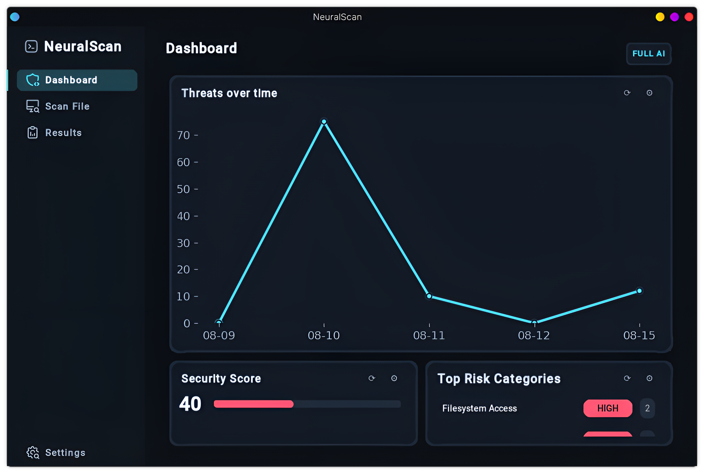
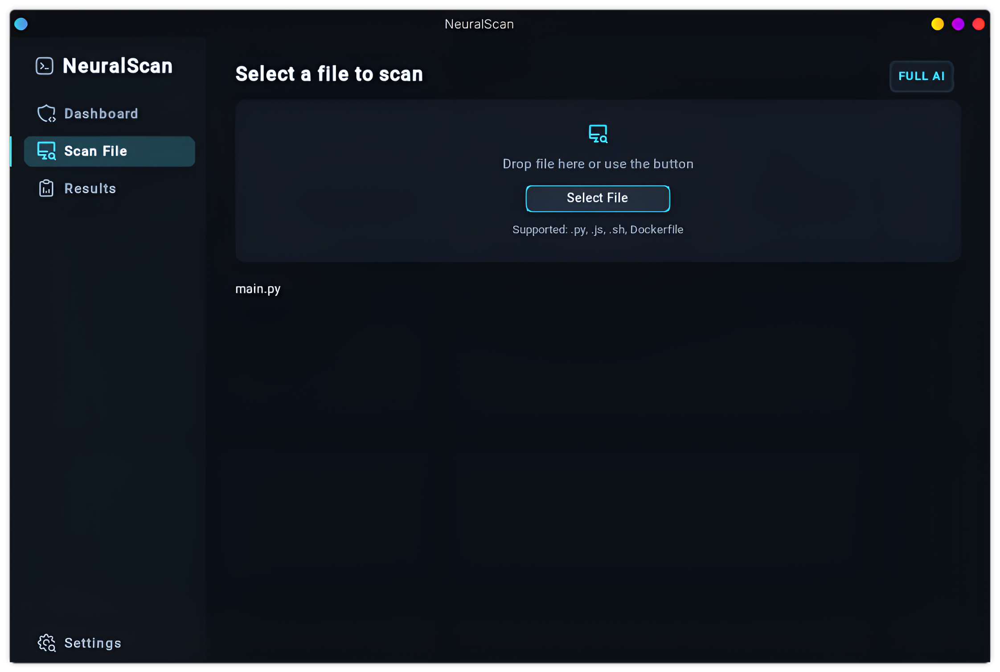
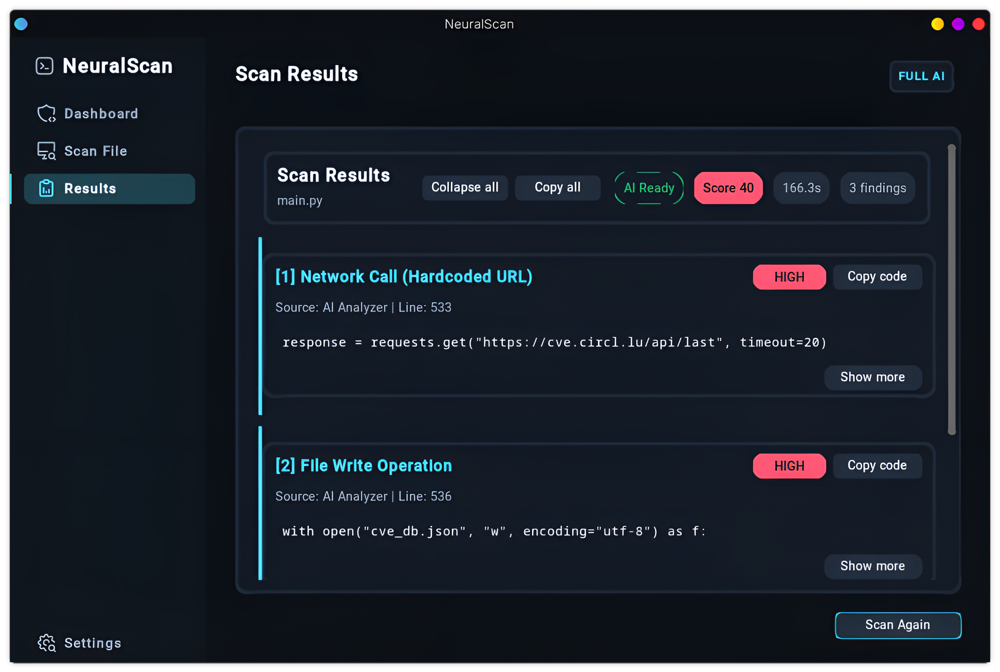

<p align="center">
  
  
  
  
</p>

<p align="center">
  
</p>

<h1 align="center">🛡️ NeuralScan</h1>

<p align="center">
  <b>Find security pitfalls fast:</b> heuristics + local AI (StarCoder2‑3B). Optional Trivy. Local‑first, MIT.
</p>

<p align="center">
  If you like it, please ⭐ the repo — it helps a lot!
</p>

---

## Table of Contents

- [Highlights](#highlights)
- [Screenshots](#screenshots)
- [System Requirements](#system-requirements)
- [Installation](#installation)
- [Quick Start](#quick-start)
- [Usage](#usage)
- [Settings](#settings)
- [Privacy](#privacy)
- [Architecture](#architecture)
- [Roadmap](#roadmap)
- [FAQ](#faq)
- [Contributing](#contributing)
- [License](#license)

---

## Highlights

- 💻 Clean desktop GUI (CustomTkinter): Dashboard, Scan, Results
- 🔎 Heuristic scanning (regex-based):
  - Command exec: `subprocess(..., shell=True)`, `os.system(...)`
  - Dynamic code: `eval(...)`, `exec(...)`
  - Unsafe deserialization: `pickle.load(...)`, `yaml.load(...)` (bez SafeLoader)
  - Weak crypto: `hashlib.md5`, `hashlib.sha1`, `DES`
  - Filesystem risks: `os.remove`, `os.unlink`, `shutil.rmtree`, zapisy `open(..., w|a)`
  - Secrets (api key/secret/password/token), AWS AKIA
  - Network IOCs: `requests.*(http[s]://...)`, surowy `socket`
- 🤖 Optional AI explanations (local): `bigcode/starcoder2‑3b` via HF Transformers  
  Falls back to deterministic text if AI is unavailable.
- 🐳 Optional Trivy (Docker) for dependency vulnerabilities & secrets
- 📊 Dashboard: security score (severity‑weighted), top risk categories, recent history (local)
- ✅ Cross‑platform: Linux / Windows / macOS, Python 3.9+
- 🔓 MIT license

---

## Screenshots

<p align="center">
   
   
   
</p>

---

## System Requirements

- Python 3.9+
- A desktop environment with Tk available
- Optional: Docker (for Trivy integration)

Tip:
- Ubuntu/Debian: `sudo apt-get install -y python3-tk`
- macOS (Homebrew): `brew install tcl-tk` (uruchamiaj Pythona ze wskazaniem na ten Tk)
- Windows: Tk zwykle wbudowany w instalator Pythona

---

## Installation

Recommended virtual environment:
```bash
python -m venv .venv
source .venv/bin/activate  # Windows: .venv\Scripts\activate
pip install --upgrade pip
```

Install core dependencies:
```bash
pip install -r requirements.txt
```

AI (optional, PyTorch):
```bash
# Example CPU-only wheel
pip install torch --index-url https://download.pytorch.org/whl/cpu
```

---

## Quick Start

```bash
python run.py
```

- Optional: start Docker daemon for Trivy integration (`docker info`)
- First AI/Trivy use may download a model/image (one-time)

---

## Usage

1. Open the app (`python run.py`).
2. Go to “Scan” and select a file (.py, .js, .sh, Dockerfile).
3. Results open automatically: findings, code snippets, explanations.  
   Each finding shows its source: AI Analyzer | Heuristic/Fallback | Trivy.
4. Dashboard → security score, top risk categories, recent history.

---

## Settings

- AI Model: e.g., `bigcode/starcoder2-3b` (local AI explanations)
- Use Trivy: enable Docker-based dependency scanning
- Minimum scan time (ms): smoother UX pacing
- AI explanation detail: short | standard | deep
- Save scan history: keeps ~30 recent scans in `data/scan_history.json`

---

## Privacy

- Local-first: analysis runs on your machine.
- Network is used only to fetch the AI model or Trivy image on first use.
- Scan history is stored locally (`data/scan_history.json`) and is git‑ignored.

---

## Architecture

- `gui/` — CustomTkinter UI  
  - `gui/main.py` — main application (`App`), views, results rendering  
  - `gui/theme.py` — theme and color tokens
- `scanner.py` — scanning logic (heuristics, optional AI/Trivy)  
  AI explains only snippets flagged by heuristics; no full‑file LLM pass by default.
- `utils/file_handler.py` — scan history I/O (`data/scan_history.json`, legacy migration)
- `run.py` — entry point
- `assets/` — icons, banner, screenshots

---

## Roadmap

- Better accessibility (focus order, hints)
- Theming presets (compact/comfortable)
- Lightweight animations for transitions
- Pluggable rule packs per language

Ideas or PRs welcome!

---

## FAQ

- Do I need Torch?  
  Only for AI explanations. Scanner works without it (deterministic fallback).
- Do I need Docker?  
  Only for Trivy integration. Without Docker, the rest of the app still works.
- Windows/macOS support?  
  Yes, if `tkinter` is available and deps install. On Linux ensure `python3-tk`.

---

## Contributing

1. Fork the repo
2. Create a feature branch
3. Make changes and test
4. Open a pull request

---

## License

MIT — see [LICENSE](./LICENSE).

